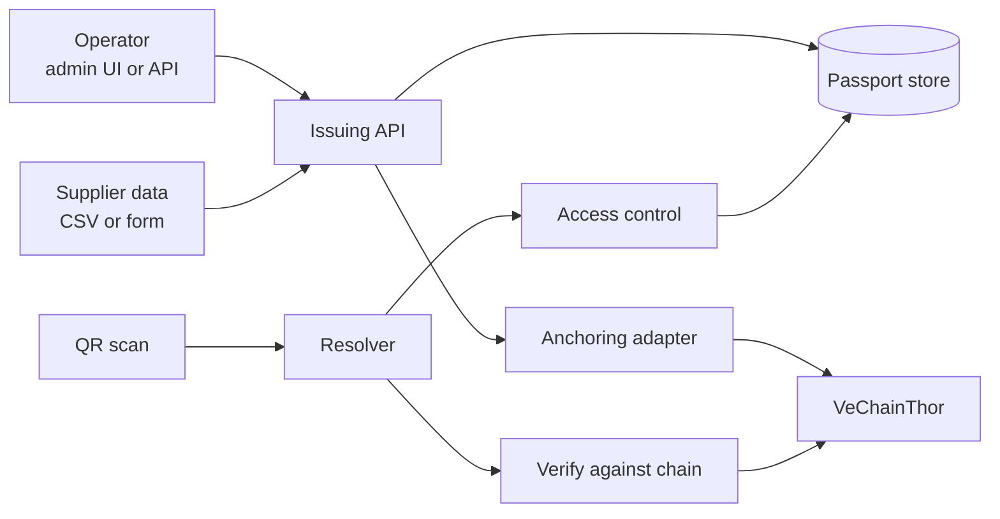
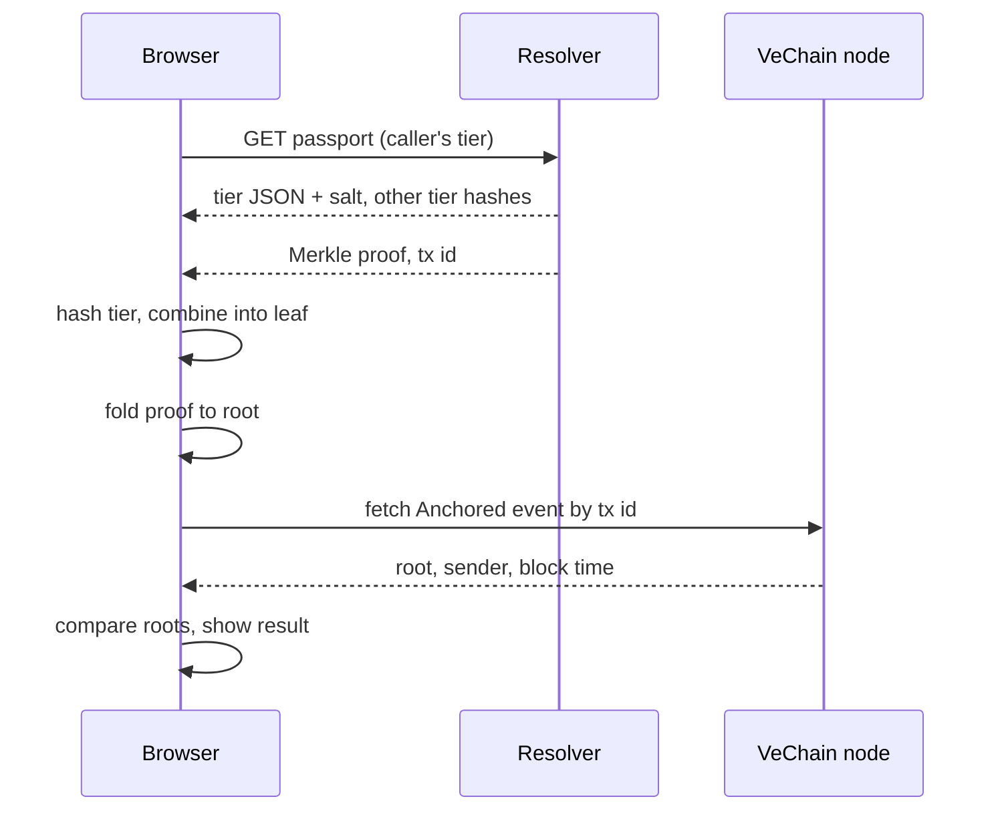

# Passant: High-Level Design v0.1

Exported 19 September 2026 from the living design doc. Where this file and `crypto-spec.md` differ on hashing details, the crypto spec wins.

## 1. Purpose and scope

Passant is an open-source toolkit for issuing, hosting and verifying EU Digital Product Passports (DPPs), with tamper-evidence anchored on a public blockchain. VeChainThor is the first supported chain; the design keeps anchoring pluggable so the product is not tied to it.

The MVP targets one regulation and one customer type: the battery passport that becomes mandatory on 18 February 2027, for small brands and importers of e-bike and e-scooter (LMT) batteries who cannot afford an SAP or Catena-X integration.

**Goals for v0.1**

- Issue a battery passport that carries the fields the regulation requires.
- Resolve a QR code on the product to a web page, with different views for the public, for parties with a legitimate interest, and for authorities.
- Anchor a hash of every passport version on-chain so later edits are detectable, and let anyone verify a page against the chain.
- Run as a single self-hosted deployment that one developer can stand up in under an hour.

**Non-goals for v0.1**

- Other product categories (textiles, electronics, furniture).
- ERP or PLM connectors, multi-tenant hosting, billing.
- Hardware integration (BMS state-of-health, NFC tags).
- Any token, wallet or crypto concept visible to end users.

## 2. Regulatory requirements

From 18 February 2027, every LMT battery, EV battery and industrial battery above 2 kWh placed on the EU market needs a battery passport under Article 77 of Regulation (EU) 2023/1542. LMT and EV batteries are in scope regardless of capacity; the 2 kWh threshold applies only to industrial batteries. The summary below is from secondary sources and must be checked against the EUR-Lex text before implementation.

| Requirement | What it means for Passant | Source |
| --- | --- | --- |
| One passport per individual battery, not per model | Model-level data is stored once and inherited by unit-level records; 10,000 packs means 10,000 passports | [batteryregulation.eu](https://www.batteryregulation.eu/battery-passport) |
| Reached through a QR code carrying a unique identifier | Identifiers follow ISO/IEC 15459 or equivalent; GS1 Digital Link is the common practical form | [digiprodpass.com](https://digiprodpass.com/blogs/digital-battery-passport-what-it-is-who-must-comply-and-when) |
| Content defined in Annex XIII | Identity, materials and composition, carbon footprint, recycled content, performance and durability, end-of-life guidance; LMT batteries may leave non-applicable points empty | [tracepass.eu](https://www.tracepass.eu/regulatory/battery-articles/article-77) |
| Tiered access | Public data, data for persons with a legitimate interest, and data for notified bodies, market surveillance authorities and the Commission | [UL Solutions](https://www.ul.com/insights/industry-insights-eu-battery-regulation-20231542) |
| Open standards, interoperable format | Machine-readable output (JSON-LD) alongside the human page; never a static PDF | [digiprodpass.com](https://digiprodpass.com/blogs/digital-battery-passport-what-it-is-who-must-comply-and-when) |
| Responsibility sits with the economic operator placing the battery on the market | For imported batteries that is the importer, which is exactly the MVP customer | [tracepass.eu](https://www.tracepass.eu/regulatory/battery-articles/article-77) |
| Data stays with the operator or a service provider; a central EU registry holds identifiers only | Passant must be able to register identifiers with the EU registry once its interface is published | [tracepass.eu](https://www.tracepass.eu/regulatory/battery-articles/article-77) |

**Standards to build on, not reinvent**

- Annex XIII of the regulation for the mandatory field list and access tier of each field.
- DIN DKE SPEC 99100 and the Battery Pass consortium content guidance for the concrete attribute definitions.
- GS1 Digital Link for the identifier and QR payload.

A Commission delegated act on access rights and on rules for entering and updating passport data was due by 18 August 2026 ([nulara.de](https://nulara.de/en-US/batteriepass)). Its status and content need checking, because it decides how the legitimate-interest tier is authenticated.

## 3. System overview

Passant is one backend service with four responsibilities (issue, store, resolve, anchor) plus a small web front end. All passport data lives off-chain in the operator's own database; the chain only ever sees hashes.



The left half is the write path: an operator creates or updates a passport, the service stores a new version and anchors its hash. The right half is the read path: a scan hits the resolver, access control picks the view for that caller, and the page can check itself against the chain.

**Lifecycle of one passport**

1. The operator defines a battery model once (chemistry, capacity, carbon footprint, recycled content).
2. For each production batch, the operator uploads serial numbers; Passant mints one unit passport per serial, inheriting the model data.
3. Each passport version is canonicalised, hashed and anchored. Batches are anchored as a single Merkle root to keep transaction counts low.
4. Passant generates the QR code for each unit for printing or engraving.
5. A scan resolves to the public view; authenticated callers get the restricted tiers.
6. Later events (repair, repurposing, recycling) append new versions; earlier versions stay retrievable.

## 4. Data model

Six entities cover the MVP. The key design choice is that passports are append-only: an update never overwrites, it adds a version, which is what makes anchoring meaningful.

| Entity | Purpose | Key fields |
| --- | --- | --- |
| Operator | The company legally responsible for the passport | name, EU address, operator identifier, API keys |
| BatteryModel | Data shared by every unit of a model | chemistry, rated capacity, carbon footprint, recycled content shares, hazardous substances, documents |
| Passport | One per physical battery | unique identifier, serial number, model reference, status (active, repurposed, waste, recycled), manufacture date and place |
| PassportVersion | Immutable snapshot of a passport's full content | version number, canonical JSON per access tier, one salt and one hash per tier, combined leaf hash, author, timestamp, reason for change |
| Anchor | Proof that a version existed unaltered at a point in time | chain id, transaction id, Merkle root, Merkle proof for this version, block time |
| AccessGrant | Who may see the restricted tiers | grantee, tier, scope (operator, model or unit), expiry |

**Field-level access tiers.** Every attribute in the schema carries a tier tag (`public`, `legitimate_interest`, `authority`) taken from Annex XIII. The resolver filters on that tag, so access rules live in the schema rather than in view code.

**Identifier.** The unique identifier is a GS1 Digital Link URL, for example `https://id.example.com/01/<GTIN>/21/<serial>`. The same URL is the QR payload, the passport's primary key in the API and the address of the public page. The domain is the operator's own, on a dedicated subdomain such as `id.brand.com`, configured through a single `BASE_URL` setting. A QR code engraved on a battery may be scanned for 15 years, so the operator must be able to repoint that subdomain to another host without depending on Passant.

**Canonical form.** Hashes are computed over JSON canonicalised with RFC 8785 (JCS), so the same content always yields the same hash regardless of key order or whitespace.

**Per-tier hashing.** Each version is split into three documents by access tier, and each is hashed with its own 16-byte random salt. The Merkle leaf is the hash of the three tier hashes in fixed order:

```
h_pub  = SHA256(salt_pub  || JCS(public fields))
h_li   = SHA256(salt_li   || JCS(legitimate-interest fields))
h_auth = SHA256(salt_auth || JCS(authority fields))
leaf   = SHA256(h_pub || h_li || h_auth)
```

A caller receives the JSON and salt for the tiers they may see, plus the bare hashes of the others. They can verify their own view against the chain without learning anything about the restricted data. Salts stop sibling leaves in a Merkle proof from being guessed, since units of one model differ mainly by serial number.

**Interoperable output.** Each passport is also served as JSON-LD, with the vocabulary mapped to the DIN DKE SPEC 99100 attribute names.

## 5. Components

Five components, deployed as one service in the MVP. Boundaries are drawn so each can be split out later without changing the others.

| Component | Responsibility | MVP surface |
| --- | --- | --- |
| Issuing API | Create models, mint unit passports in bulk, append versions, validate against the schema | REST + OpenAPI; `POST /models`, `POST /passports:batch`, `POST /passports/{id}/versions` |
| Resolver | Turn an identifier URL into the right representation | HTML for browsers, JSON-LD on content negotiation, `?version=n` for history |
| Access control | Decide which tier a caller gets | Public by default; signed, expiring grant tokens for the restricted tiers |
| Supplier intake | Get model data in without an ERP | CSV template upload and a web form, both validated against the schema |
| Anchoring adapter | Commit hashes to a chain and verify them | Interface with `anchor(root)`, `verify(hash, proof)`, `status(txId)`; VeChain implementation first |

**Admin UI.** A minimal web app over the Issuing API: define a model, upload serials, download QR codes as SVG or PDF sheets, view anchor status. No separate backend.

**Adapter contract.** The adapter knows nothing about passports. It receives a 32-byte root and returns a receipt, which keeps a second chain, or a non-blockchain timestamping service such as RFC 3161, a drop-in addition.

**QR generation.** QR codes encode only the identifier URL, with error correction level Q to survive engraving and wear.

## 6. VeChain integration

Only one thing goes on-chain: a 32-byte Merkle root per anchoring batch, emitted as an event by a small registry contract. No product data, no identifiers, no personal data.

**Registry contract.** A minimal Solidity contract with one function, `anchor(bytes32 root)`, that emits `Anchored(root, sender, timestamp)`. Events are cheaper than storage and are all that verification needs. The sender address identifies the operator, so each operator anchors from its own key.

**Batching.** Versions created within a window (default 10 minutes, or 1,000 versions) are combined into one Merkle tree and anchored in one transaction. Each version stores its own Merkle proof, so it can be verified independently. A brand issuing 10,000 passports produces about 10 transactions, not 10,000.

**Fee delegation.** VeChain's designated gas payer mechanism (VIP-191) lets a sponsor pay VTHO for a transaction signed by someone else. Self-hosters fund their own sponsor wallet; a future hosted service sponsors on the customer's behalf. Either way, operators sign with a key and never hold tokens.

**Verification flow**



Verification runs in the visitor's browser against a public node, so the check does not depend on trusting the Passant server that served the page. The browser uses the same `core` package as the server for canonicalisation, hashing and proof folding, which is why both are written in TypeScript.

**Cost note.** Since the December 2025 Hayabusa upgrade, VTHO is generated by staked VET rather than by simply holding it. A sponsor wallet therefore needs either purchased VTHO or a staked VET position; batching keeps the amounts small. Actual per-anchor cost should be measured on testnet.

**To verify on testnet before relying on it:** current SDK package names and versions, VIP-191 behaviour under the post-Galactica fee market, and event query limits on public nodes.

## 7. Security, privacy and GDPR

The hashes-only rule removes the hardest problem: nothing on the immutable ledger can ever need erasing. The remaining risks are ordinary web-service risks plus one that is specific to passports, the link between the tag and the physical item.

| Risk | Mitigation |
| --- | --- |
| Personal data ends up on-chain | Only Merkle roots are anchored; leaves are salted so a hash cannot be brute-forced back to low-entropy content |
| Restricted-tier data leaks | Tier tags enforced in one place (the resolver filter); restricted responses never cached; grants are signed and expire |
| Operator signing key stolen | Keys held in an encrypted keystore or KMS; key rotation supported by registering a new sender address for the operator |
| Identifier enumeration (guessing serials to scrape a catalogue) | Rate limiting; serial component may be a random token rather than the factory serial |
| QR code copied onto a counterfeit battery | Out of scope for software alone; flagged to the user as a known limit, addressed later by secure NFC tags |
| Passport outlives the operator | Export of the full store in an open format; backup copy with an independent provider, which the ESPR framework is expected to require |
| Tampering by the operator itself | Append-only versions plus anchoring make silent edits detectable; this is the core value of the chain |

**Personal data inventory.** Battery passports are mostly product data. Personal data appears in operator user accounts and possibly in repair or ownership events later. The MVP stores no end-user or owner data at all.

**Hosting.** Data for EU operators should sit in an EU region, which matters for the future hosted service more than for self-hosters.

## 8. Tech stack

The stack is TypeScript end to end, because VeChain's official SDK is JavaScript-first and one language keeps a solo project small. The deciding reason is that the in-browser verifier and the server must share one implementation of the hashing code. Backend language, database and licence are decided; the other rows are proposals.

| Layer | Proposed | Alternative | Why |
| --- | --- | --- | --- |
| Backend | Node.js + TypeScript, Fastify | Python + FastAPI | The official VeChain SDK is TypeScript; schema types are shared with the front end |
| Database | PostgreSQL, JSONB for version snapshots | SQLite for single-box installs | Append-only tables and JSONB suit immutable versions; Postgres scales to the hosted service |
| Schema | JSON Schema as the source of truth, types generated from it | Hand-written types | One artefact drives validation, the API docs and the CSV template |
| Front end | Server-rendered pages for the public passport view; a small React app for admin | One React app for both | Public pages must load fast on a phone after a QR scan and work without JavaScript |
| Contract | Solidity, Hardhat with the VeChain plugin | None | The contract is about 20 lines; tooling choice matters little |
| Packaging | Docker Compose: app, Postgres, optional Thor solo node for development | Bare install | Meets the goal of a one-hour self-hosted setup |
| Licence | Apache 2.0 with a lightweight CLA | AGPL | Agreed earlier: enterprise-friendly, keeps dual-licensing open |

**Repository layout.** A monorepo with packages for `schema`, `core` (hashing, Merkle, canonicalisation), `adapter-vechain`, `server`, and `web`. `core` and `schema` have no chain or server dependencies, so other projects can reuse them.

## 9. MVP vertical slice and milestones

The first deliverable is one thin path through every component: create a passport, print its QR, scan it, and see a green "verified on-chain" result. Estimated at six weeks of part-time solo work; the weeks below are effort, not calendar dates.

| Milestone | Deliverable | Done when |
| --- | --- | --- |
| M0, week 1 | Requirements pass: Annex XIII and DIN DKE SPEC 99100 read; LMT field list with tier tags drafted as JSON Schema | Schema validates one hand-written sample e-bike battery passport |
| M1, week 2 | `core` package: canonicalisation, salted hashing, Merkle tree and proofs, with tests | Proofs round-trip for 1, 2 and 1,000 leaves |
| M2, week 3 | `server`: models, batch mint, versions, Postgres persistence, OpenAPI | Batch of 100 passports created through the API |
| M3, week 4 | `adapter-vechain`: registry contract on testnet, batched anchoring, fee delegation | Anchor transaction visible on the testnet explorer, paid by the sponsor wallet |
| M4, week 5 | Resolver: public HTML page, JSON-LD, QR generation, in-browser verification | Scanning a printed QR with a phone shows the passport and a passing check |
| M5, week 6 | Docker Compose, README, demo data set, short demo video | A fresh machine reaches a working demo in under an hour |

**Deliberately left out of the slice:** restricted-tier access grants, the admin UI (the API plus a script is enough for the demo), CSV intake, and EU registry integration. They follow once the slice has been shown to a pilot user and to the VeChain grant programme.

**In parallel, non-code:** trademark and domain checks for the name, the GitHub organisation, and a shortlist of five e-bike battery brands or importers to approach with the demo.

## 10. Decisions and open questions

Four design forks were closed on 19 September 2026, so an implementing agent does not have to guess.

| Decision | Choice | Reason |
| --- | --- | --- |
| Backend language | TypeScript | Server and in-browser verifier share one `core` package, so they cannot disagree about a hash |
| Leaf hashing | Salted, one hash per access tier, combined into the leaf | Lets every tier verify its own view; stops sibling leaves being guessed |
| Identifier domain | Operator's own dedicated subdomain, set by `BASE_URL` | Passports must outlive any host, including Passant |
| Database | PostgreSQL only | One code path to test; JSONB fits immutable versions; needed for hosting anyway |

The questions below are still open. The first three could change the design; none blocks the first vertical slice.

- [ ] Has the Commission adopted the delegated act on passport access rights (due 18 August 2026), and what authentication does it require for the legitimate-interest tier?
- [ ] Is the EU DPP registry live, and is there a published interface for registering identifiers?
- [ ] Must a DPP service provider be established in the EU, and does that apply to software that operators self-host?
- [ ] Does the battery passport need a GTIN from GS1 (a paid membership for the operator), or is another ISO/IEC 15459 issuer acceptable for small importers?
- [ ] Is a VeChain Foundation grant programme currently open, and what strings does it attach to IP and chain exclusivity?

## 11. Later phases

Everything below is out of scope for v0.1 and listed only so early decisions do not block it.

| Phase | Adds | Depends on |
| --- | --- | --- |
| v0.2 | Restricted-tier access grants, admin UI, CSV supplier intake, EU registry registration | Delegated act on access rights; registry interface |
| v0.3 | Lifecycle events: repair, repurposing, change of responsible operator, recycling | A pilot user with real second-life flows |
| Hardware | BMS state-of-health import over CAN or UART; secure NFC tags that bind the passport to the physical pack | Pilot hardware; tag vendor choice |
| Hosted service | Multi-tenant hosting, sponsored gas, independent backup copies, support contracts | Legal entity; service-provider rules under the ESPR |
| New categories | Textiles, electronics, furniture schemas as their delegated acts land (2028 onward) | Schema package kept independent of batteries from day one |
| Second anchor target | Another EVM chain or RFC 3161 timestamping through the same adapter interface | Customer demand |

## Sources

- [Battery passport overview, batteryregulation.eu](https://www.batteryregulation.eu/battery-passport)
- [Article 77 battery passport, tracepass.eu](https://www.tracepass.eu/regulatory/battery-articles/article-77)
- [EU Battery Passport 2027, nulara.de](https://nulara.de/en-US/batteriepass)
- [Industry insights into EU Battery Regulation 2023/1542, UL Solutions](https://www.ul.com/insights/industry-insights-eu-battery-regulation-20231542)
- [Digital battery passport guide, digiprodpass.com](https://digiprodpass.com/blogs/digital-battery-passport-what-it-is-who-must-comply-and-when)

These are secondary summaries read as search excerpts on 18 September 2026. The regulation text on EUR-Lex is the authority and has not yet been checked line by line.
